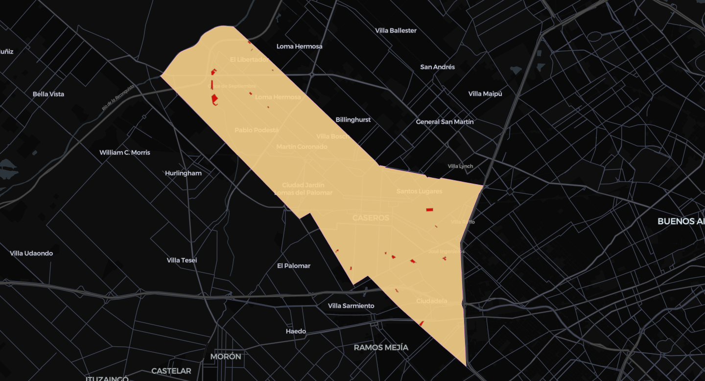
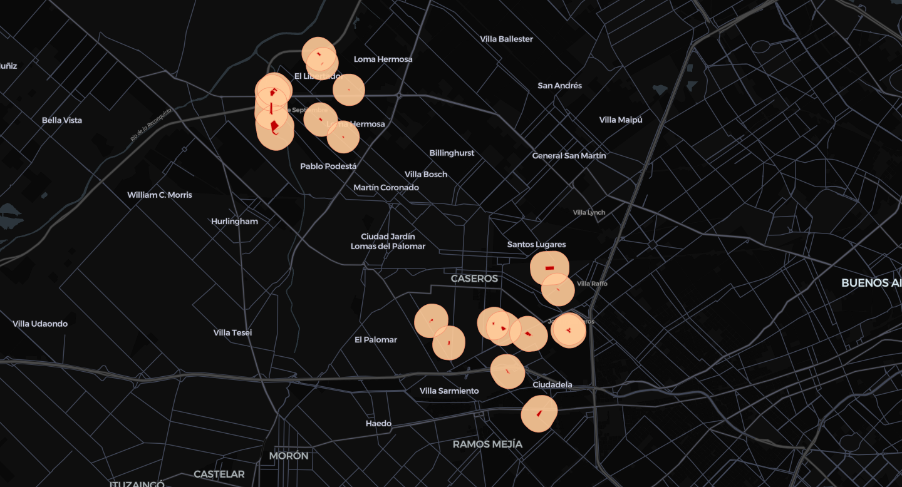
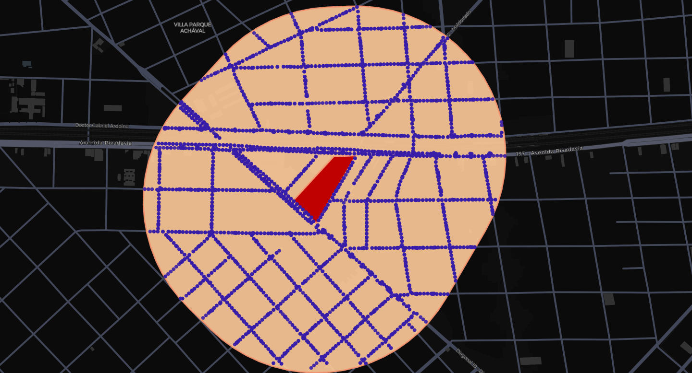
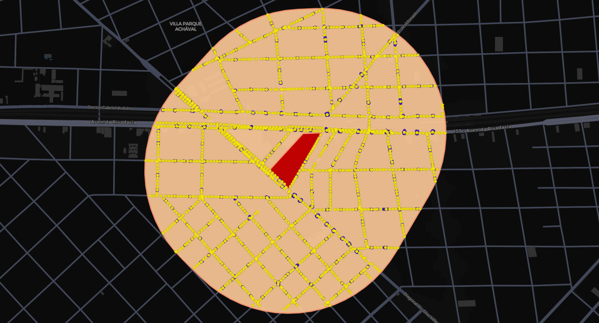

# Street Level Change

`street-level-change` is a Python-based project aimed at measuring urban change at the street level by leveraging Google Street View imagery. The primary focus is on analyzing informal housing settlements in Argentina to understand their evolution and dynamics over time.

## Research Question

How have informal housing settlement areas changed through time?

## Project Overview

This project is at an early stage, exploring how to obtain panorama points from Google Street View around informal housing areas from Argentina's [ReNaBaP](https://www.argentina.gob.ar/obras-publicas/sisu/renabap) (Registro Nacional de Barrios Populares - National Registry of Popular Neighborhoods).

### Methodology

- Using Python and Google Street View API to obtain images in informal areas
- Employing computer vision models to quantify or analyze changes in these areas
- Indexing panorama points to consistent locations to assess change dynamics accurately
- Calculating coverage area by informal settlement polygon

### Scope

- Currently focused on ReNaBaP data
- Methodology tests are being conducted in:
  - La Plata, Buenos Aires, Argentina
  - San Isidro, Buenos Aires, Argentina
  - 3 de Febrero, Buenos Aires, Argentina

## Usage

The project provides a Makefile to run the pipeline. The main entry point can be found at `scripts/run_pipeline.py`, where we can set the `region_slug` that will be used to store the results (`data/<region_slug>`), and the `region_osm` that will be used to mask the ReNaBaP data for small tests. To run the pipeline, we can use the following command:

```bash
make run
```

## Workflow Overview

The `region_osm` parameter will filter out the [original ReNaBaP polygons](https://www.argentina.gob.ar/obras-publicas/sisu/renabap/mapa) to only include the region of interest.



The resulting data will be buffered to include a 500-meter margin around the each ReNaBaP polygon.



Then, the buffered regions will be used to query the Google Street View API for panorama data.



Finally, the panorama points will be unified using DBSCAN clustering.



Coverage is determined by calculating the area of intersection between the ReNaBaP polygon and the panorama points buffered by 5 meters.


## Fetching GSV images

```python street_view_images/street_view_fetcher.py```

## Segmentation

```python STEGO/src/segment_street_view.py```


## Next Steps & Future Developments

- Downloading Google Street View images for proof-of-concept areas
- Implementing computer vision models to quantify changes over time

## Contact

- Ricardo Pasquini - [rpasquini@utdt.edu](mailto:rpasquini@utdt.edu)
- Jerónimo Luza - [jeronimoluza@gmail.com](mailto:jeronimoluza@gmail.com)
