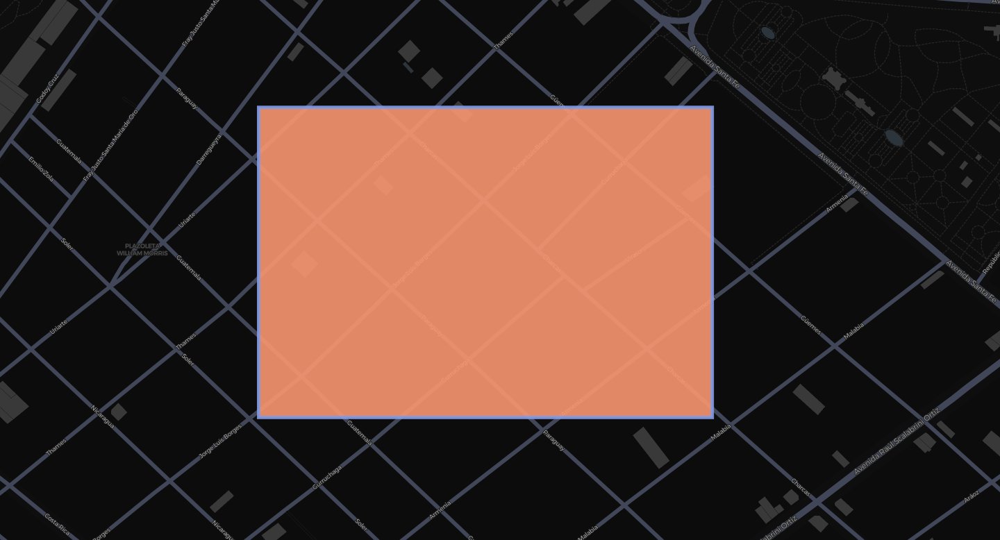
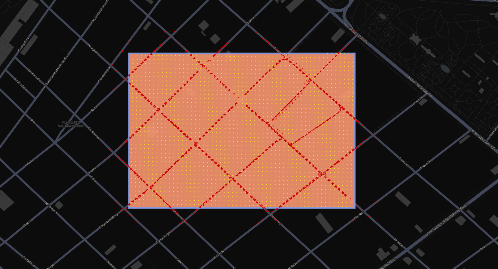

# street-level-change

`street-level-change` is a Python-based pipeline to map and measure urban infrastructure change over time using Google Street View imagery.

## Dependencies

This project uses Poetry for dependency and environment management. To get started:

```bash
poetry install
```

To run the project:

```bash
poetry run python run.py
```

## Workflow Overview

**Step 1: Define a Region**:

Provide a polygon representing the area of interest.



**Step 2: Create a Grid of Points**:

Generate evenly spaced points (e.g., every 10 meters) within the polygon using geospatial transformation to UTM coordinates for accurate spacing.

```python
points = src.utils.create_point_grid(region, 10)
```


**Step 3: Query Street View API**:

Each point is queried to check for nearby Google Street View panoramas, and metadata such as pano ID, location, and date are collected.

```python
panos = src.sv.get_panos(points)
```



## Roadmap

### Primary

- [ ] Connect panorama points to the OpenStreetMaps street grid (https://github.com/rpasquini/street-level-change/issues/3) and calculate area of coverage in meters (https://github.com/rpasquini/street-level-change/issues/1).

### Secondary

- [ ] Generate a street grid from Google Street View images (https://github.com/rpasquini/street-level-change/issues/4).
